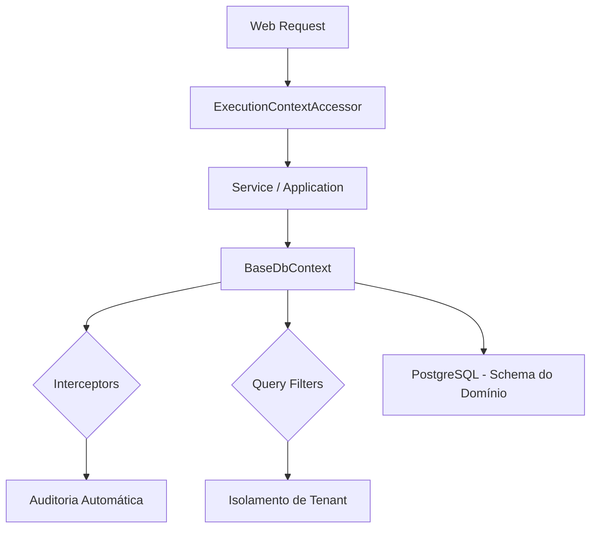

# Arquitetura ERPModular

O ERPModular é um sistema SaaS construído com uma arquitetura **Multi-Domínio** e **Multi-Tenant**, focada em isolamento de dados e escalabilidade.

## Autenticação e Autorização

Para o ERPModular, adotamos uma estratégia híbrida focada em segurança e escalabilidade.

### 1. Web Portal (Blazor Server): Cookies + Identity
Utilizamos o **ASP.NET Core Identity** padrão com autenticação baseada em **Cookies Seguros**.
-   **Segurança (XSS)**: Cookies com a flag `HttpOnly` são invisíveis para JavaScript, protegendo o sistema contra roubo de credenciais via scripts maliciosos.
-   **Experiência SPA**: Como o Blazor Server mantém uma conexão persistente (SignalR), o uso de Cookies simplifica o gerenciamento de sessão no servidor.
-   **Produtividade**: O framework gerencia automaticamente login, logout e expiração.

### 2. APIs e Mobile: Preparação para JWT
Embora o portal use Cookies, a arquitetura é projetada para suportar **JWT (JSON Web Tokens)** no futuro.
-   **Base Única**: A tabela de usuários (Identity) será a mesma.
-   **Múltiplos Handlers**: O ASP.NET Core permite habilitar Cookies para o site e JWT para endpoints de API (`/api/*`) simultaneamente.
-   **Vantagem**: Isso permite que criemos um aplicativo mobile nativo ou integrações externas sem refatorar a segurança do sistema.

## Camadas do Sistema

O projeto segue os princípios da **Clean Architecture**:

1.  **Shared.Domain**: Núcleo do sistema. Contém entidades base, enums, interfaces e o contexto de execução. Não possui dependências externas.
2.  **Shared.Application**: Contém as regras de negócio e interfaces de serviços genéricos.
3.  **Shared.Infrastructure**: Implementação técnica de acesso a dados (EF Core), interceptores de auditoria e configurações de banco de dados.
4.  **Presentation (Web)**: Interface de usuário construída em Blazor Server (.NET 9).

## Estratégias de Isolamento

### 1. Isolamento por Domínio (Multi-Schema)
Cada segmento de negócio (ex: Confecção, Farmácia) possui seu próprio **Schema** no banco de dados PostgreSQL.
-   Schema: `domain_{nome_do_dominio}`
-   Configurado no `BaseDbContext` via `modelBuilder.HasDefaultSchema`.

### 2. Isolamento por Tenant (Global Query Filters)
Dentro de cada domínio, os dados de diferentes empresas são isolados logicamente.
-   Toda entidade que herda de `BaseEntity` possui um `TenantId`.
-   Um filtro global (`Query Filter`) é aplicado automaticamente em todas as consultas SQL: `WHERE TenantId = 'context.TenantId'`.

## Auditoria Automática

Utilizamos o `TenantInterceptor` (EF Core Interceptor) para garantir que:
-   `TenantId` e `EmpresaId` sejam preenchidos automaticamente no `INSERT`.
-   Campos de auditoria (`CreatedAt`, `CreatedBy`, `UpdatedAt`, `UpdatedBy`) sejam atualizados sem intervenção do desenvolvedor.

## Contexto de Execução

O `ExecutionContext` é o "crachá" da operação, contendo:
-   `DomainId`
-   `TenantId`
-   `EmpresaId`
-   `UserId`

Este contexto é acessado via `IExecutionContextAccessor`, permitindo que as camadas de infraestrutura tomem decisões de isolamento em tempo de execução.

---

## Diagrama de Fluxo (Simplificado)

